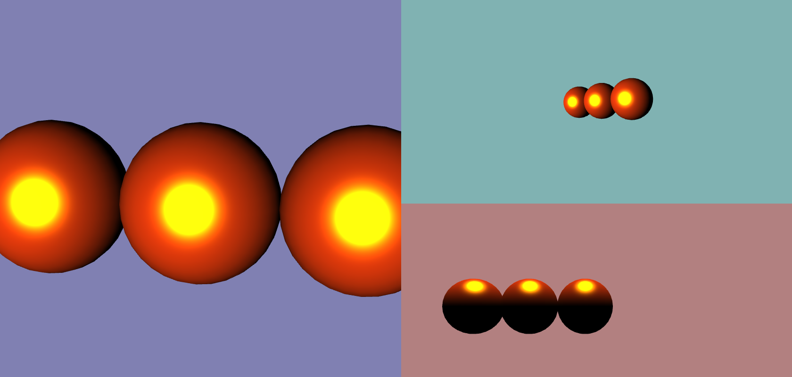
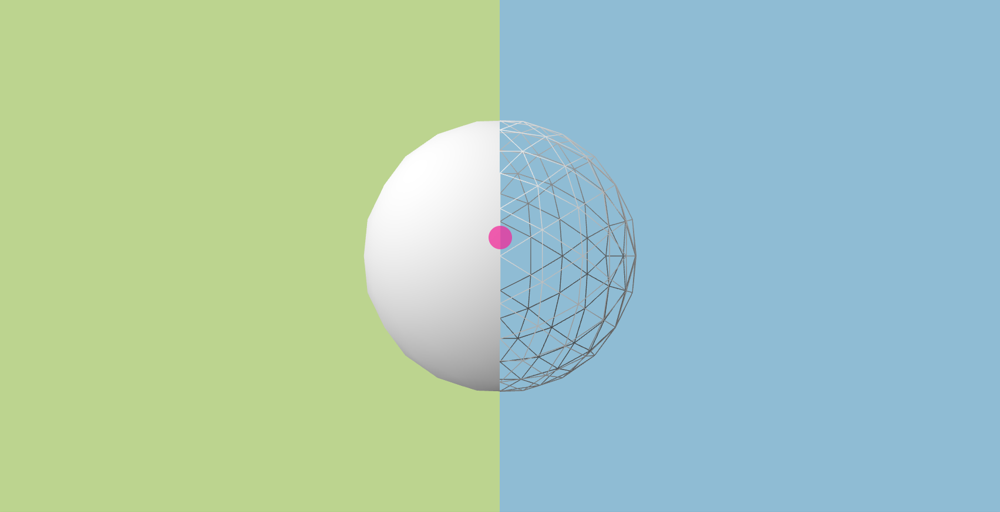
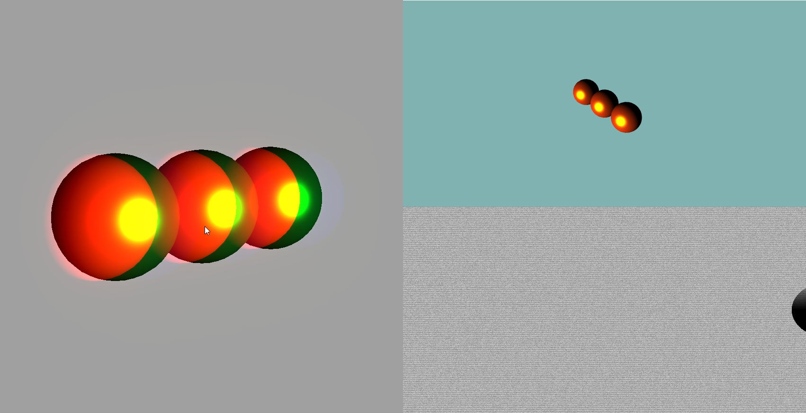
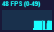
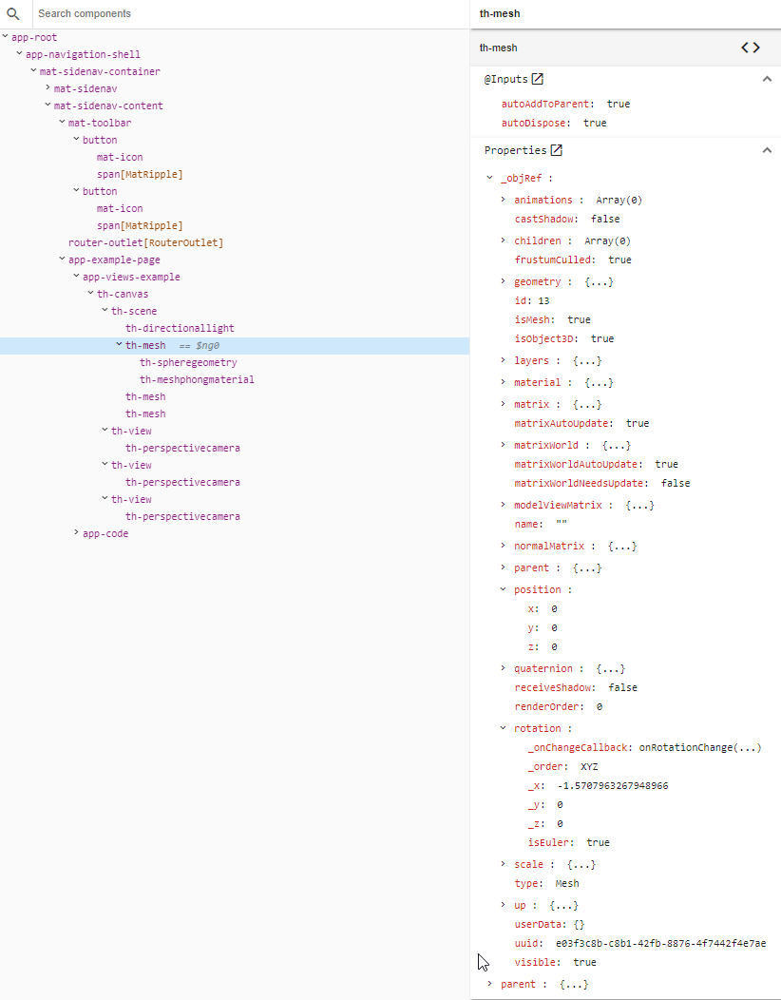
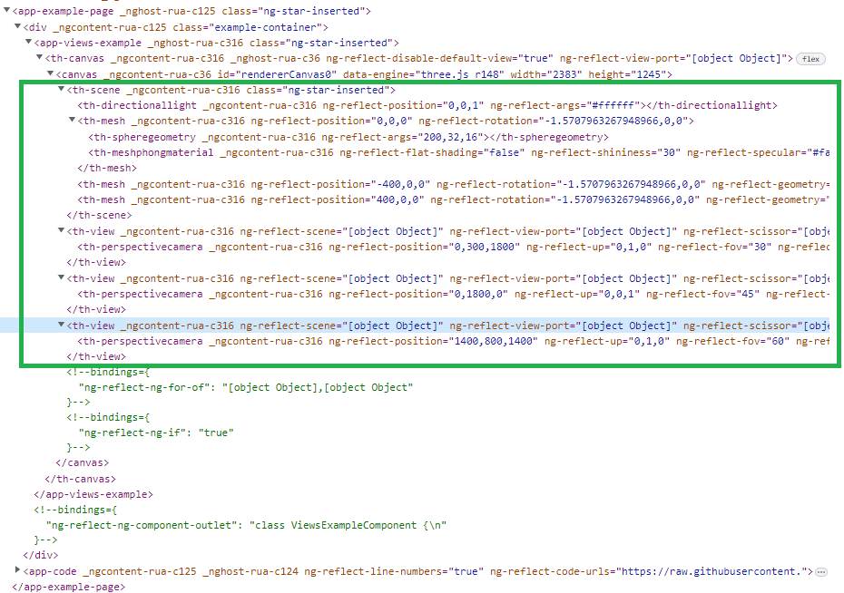
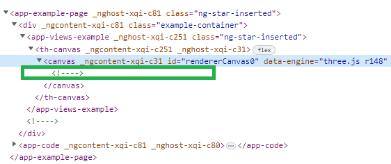

# NgxThree [](https://badge.fury.io/js/ngx-three) 

NgxThree wraps [three.js](https://threejs.org/) in Angular components.
It allows to render 3d Scenes in a declarative way. And you can leverage
the angular features and ecosystem your are familiar with.

## What's in the box

ngx-three uses code generation to be able to provide as much functionality from three js.
This approach makes it possible to follow three.js updates with minimal effort.

ngx-three:

- generates wrappers (> 130) for three.js class categories:
  - Object3d,
  - Material,
  - Geometry,
  - Post processing passes,
  - Controls
  - Textures
- Adds support for simple pointer event handling
- Easy handling of async model loading
- Supports Multi-View / Multi-Scene scenarios
- enables declarative post processing
- ...

The project is inspired by the great [react three fiber](https://github.com/pmndrs/react-three-fiber) library.
But in contrast to RTF angular components are generated that wrap three.js classes.

Check out some [examples](https://demike.github.io/ngx-three/)

## Performance

From a performance perspective it's important to know, that ngx-three components
do not produce any DOM elements.

In addition the generate classes use OnPush change detection strategy
and the scene rendering runs outside the angular zone.

This means there is no overhead because of additional DOM elements and the impact of angular's change detection
mechanism should be minimized.

# Installation

```
npm install ngx-three
```

In addition to ngx-three you have to install it's peer dependencies
Angular ([setup howto](https://angular.io/guide/setup-local)), three.js and its typings

```
npm install three
npm install @types/three
```

You can use npm to get the exact peer dependency versions for ngx-three

```
npm info ngx-three peerDependencies
```

# Introductory Example

We are going to create a basic example showing a cube,
with animation and interaction.

## Step 1) Basic Angular Component

Lets start by creating a simple component with an empty template.

```typescript
import { Component } from '@angular/core';

@Component({
  selector: 'app-example',
  template: ` <!-- Step 2 Content  --> `,
})
export class ExampleComponent {}
```

## Step 2) Add a Canvas

As a second step we start filling the template with
a canvas and a scene (the most basic setup).

```html
<th-canvas>
  <th-scene>
    <!-- Step 3 Content -->
  </th-scene>
</th-canvas>
```

## Step 3) Adding a Mesh ( The Box )

In this step we are adding a mesh with material and geometry.
You can add material and geometry to the mesh by nesting `th-*Material` and `th-*Geometry` components
inside a `th-mesh` componet.

By means of the `args` attribute you can pass parameters
to the constructor of the three.js basic material.

```html
<th-mesh>
  <th-boxGeometry></th-boxGeometry>
  <th-meshBasicMaterial [args]="{color: 'purple'}"> </th-meshBasicMaterial>
</th-mesh>
<!-- Step 4 Content -->
```

## Step 4) Camera and Light

Now lets bring some (ambient)light to the scene.

The perspective camera takes multiple constructor arguments.  
These can be passed to the camera constructor by passing an
an array holding the arguments to `args`.

The position of the camera is set by means of the `position` attribute.

```html
<th-ambientLight> </th-ambientLight>
<th-perspectiveCamera [args]="[75, 2, 0.1, 1000]" [position]="[1,1,5]">
</th-perspectiveCamera>
```

## Step 5) Interacting with the box

By adding a boolean member `selected` to our class
we can modify the scale of the cube

```html
<th-mesh>
  (onClick)="selected = !selected" [scale]="selected ? [2, 2, 2] : [1, 1, 1]"
  ...
</th-mesh>
```

## Step 6) Animating the box

By reacting to the canvas' `onRender`
we can animate the box by setting its rotation.

Template:

```html
<th-canvas (onRender)="this.onBeforeRender()">
  ...
  <th-mesh [rotation]="rotation" ...> ... </th-mesh>
  ...
</th-canvas>
```

Component:

```typescript
  ...
  public rotation: [x: number, y: number, z: number] = [0, 0, 0];
  public onBeforeRender() {
    this.rotation = [0, this.rotation[2] + 0.01, this.rotation[2] + 0.01];
  }
  ...
```

## Step 7) Creating a reusable Angular component

The mesh part of the current code can be seperated into its own class
Then we can use two instances ot the box component in the app component
Take a look at the [working example](https://demike.github.io/ngx-three/introductory-example)

Box Template:

```html
<th-mesh
  [rotation]="rotation"
  [position]="position"
  (onClick)="selected = !selected"
  [scale]="selected ? [2, 2, 2] : [1, 1, 1]"
>
  <th-boxGeometry></th-boxGeometry>
  <th-meshBasicMaterial [args]="{color: 'purple'}"></th-meshBasicMaterial>
</th-mesh>
```

Box Component:

```typescript
@Component({
  selector: 'app-box',
  template: `...`,
  changeDetection: ChangeDetectionStrategy.OnPush,
})
export class Box {
  selected = false;
  @Input()
  public rotation: [x: number, y: number, z: number] = [0, 0, 0];
  @Input()
  public position: [x: number, y: number, z: number] = [0, 0, 0];
}
```

App Template:

```html
<th-canvas (onRender)="this.onBeforeRender()">
  <th-scene>
    <th-box [position]="[-2,0,0]" [rotation]="rotation"> </th-box>
    <th-box [position]="[2,0,0]" [rotation]="rotation"> </th-box>
    <th-ambientLight> </th-ambientLight>
    <th-perspectiveCamera
      [args]="[75, 2, 0.1, 1000]"
      [position]="[1,1,5]"
    ></th-perspectiveCamera>
  </th-scene>
</th-canvas>
```

App Component:

```typescript
@Component({
  selector: 'app-example',
  template: `...`
  changeDetection: ChangeDetectionStrategy.OnPush
})
export class ExampleComponent {
  public rotation: [x: number, y: number, z: number] = [0, 0, 0];
  public onBeforeRender() {
    this.rotation = [0, this.rotation[2] + 0.01, this.rotation[2] + 0.01];
  }
}
```

# Canvas / View / Scene

!!! WORK IN PROGRESS !!!

Canvas View and Scene are the main building blocks of ngx-three.

## ThCanvas

In general the `ThCanvas` contains [ThView](#ThView) istances, and a
[ThView](#ThView) contains a [ThScene](#ThScene).

In a standard scenario `ThCanvas` provides (or actually 'is') the default view.
So a typical template might look like this

```html
<th-canvas>
  <th-scene> ... </th-scene>
</th-canvas>
```

`ThCanvas` creates the canvas dom element that's used
for rendering. Actually ThCanvas is the <b>only</b> ngx-three component that inserts an element into dom!

`ThCanvas` provides the [ThEngineService](#Render-Loop-/-ThEngineService).
That means if you have multiple `ThCanvas` instances
every one gets its own engine service.

As `ThCanvas` is derived from `ThView` it also shares its inputs / outputs

In addition `ThCanvas` also provides an input `rendererParameters`. It takes a configuration object
that allows for setting all the members provided by the
[THREE.WebGLRenderer](https://threejs.org/docs/#api/en/renderers/WebGLRenderer).

## ThView

One can say that `ThView` provides the view port.
The view consists of:

- a scene [ThScene](#ThScene)
- a camera (`ThCamera`)
- and an <b>optional</b> effect composer (`ThEffectComposer`)

This combination makes it possible to render multiple scenarios

- The same scene with multiple camera perspectives ([Multi View Example](https://demike.github.io/ngx-three/views-example))
  
- mutliple scenes with the same camera ([Multi Scene Example](https://demike.github.io/ngx-three/multi-scene-example))
  
- one / multiple scene with multiple effects ([Multi Effects Example](https://demike.github.io/ngx-three/multi-view-postprocessing-example))
  

## ThScene

`ThScene` is the ngx-three wrapper of THREE.Scene and provides all
of its members as inputs. It is <b>mandatory</b> for rendering.

## ThAnimationLoop / ThEngineService / ThRenderDirective

### Render Loop
The `ThAnimationLoop` service runs the render loop.
You can `start` and `stop` the loop.
In addition you can request a 'one-shot` rendering
by calling the Service-method `requestAnimationFrame`;

You can react to a 'global' render event by means of listening to the 
`ThAnimationLoop.beforeRender$` observable
or by using the `beforeRender` output of the `ThRenderDirective`.

```html
<th-object3D (beforeRender)="doSomething()" ></th-object3D>
```

In addition you can react to the `onRender`
outputs of the `ThView` (`ThCanvas` is derived from it) instances.

```html
<th-canvas (onRender)="doSomething()"></th-canvas>
```

### Resize-Handling & Device Pixel Ratio

For common scenarios ngx-three handles resizing automatically by observing the
size of the canvas.

But for special scenarios ([Multi View Example](https://demike.github.io/ngx-three/views-example)) you might have to do calculations when the size changes.
This can be achieved by:
- using the `onResize` event of the `ThRenderDirective`.
```html
<th-object3D (onResize)=calculateSomething($event)></th-object3D>
```
- or by subscribing to the `resize$` of the `ThEngineService`

The `ThEngineService` takes care of resizing, does the rendering and organizes the available views ([ThView](#ThView))

> Note: The engine service **automatically** takes into account the device pixel ratio when calculating the renderer dimensions. This works dynamically i.e.: when moving the window from one display to a second one with different device pixel ratio.

### On-Demand Rendering

In case you do not need an animation (i.e.: static model viewer)
you can disable the animation loop by setting `renderOnDemand` to true.
From this time on the render calls only happen in following cases:
- Angular change detection is triggered for one of `ThCanvas`' children 
- A controller fires an event

This works with `OrbitControls`, `MapControls`, `DragControls`, `TransformControls` and `ArcBallControls`.
But `FlyControls`, `TrackbalControls` and `FirstPersonControls` need a render loop.
You can play with these controls and on-demand rendering in the [On-Demand Example](https://demike.github.io/ngx-three/on-demand-example).

Example:

This allows to render only once to show a scene (i.e.: resulting from a loaded GLB file). 
And while you move the camera by means of the orbit control continuous render calls will be triggered. When you stop moving no render calls will happen.

Let's say you change the background color that is bound in a template.
In this case the angular changed detection mechanism triggers and the
scene is rendered (once).

```html
<th-canvas [renderOnDemand]="doOnDemandRendering"></th-canvas>
```

# Objects / Meshes

In three.js anything that can be added to a Scene is an `Object3D`.
In ngx-three the component `ThObject3D` with the tag `th-object3D` can be seen as the equivalent.

A mesh (`Three.Mesh`) can be represented by `th-mesh` in ngx-three.
A mesh can have a material (`ThMaterial`) and a Geometry(`ThGeometry`).

```html
<th-mesh>
  <th-boxGeometry></th-boxGeometry>
  <th-meshBasicMaterial></th-meshBasicMaterial>
</th-mesh>
```

Every ngx-three object has a member called
`objRef` this one holds the reference to the
three.js object.
For example `ThMesh` has a member `objRef: THREE.Mesh`.

<!-- TODO: GO ON -->

## Referencing objects in a component

There are two ways to reference existing ngx-three object
class instances.

### 1) ViewChild

You can use ViewChild to reference template objects
from within the component code.

```typescript
@Component({
  selector: 'app-myapp',
  template: ` <th-mesh></th-mesh> `,
})
export class MyApp {
  @ViewChild(ThMesh, { static: true }) mesh: ThMesh;
}
```

### 2) Angular Template Variables

Referencing ngx-three objects (`th-object3D`) can be
easiliy referenced from within the template by means
of template variables

```html
<th-mesh>
  <th-boxGeometry #theGeo></th-boxGeometry>
</th-mesh>
<th-mesh>
  <th-material [objRef]="theGeo.objRef"></th-material>
  <th-meshBasicMaterial></th-meshBasicMaterial>
</th-mesh>
```

## How to put existing THREE.Object3D objects into the angular template

If you want to put an existing object into the angular component tree
(maybe it was easier to construct the specific object in an imperative way)
this can be easily achieved by setting the `objRef` Attribute

```
<th-object3D [objRef]="existingObj"></th-object3D>
```

# Model Loading

ngx-three provides an easy way to load models / scenes and apply it
to a `th-object3D` element.
It implements a generic loader service, loader directive and loader pipe,
That is then used by the specific loader implementations

All types of loaders can load models by means of:

- a loader service
  - provides a Promise of the resulting 'model'
  - a progress callback
- a directive
  - applies the model to the host `ThObject3d` component ( to its `objRef`)
  - provides a progress output
  - provides a loaded output
- a pipe
  - provides a progress callback

under the hood the directive and the pipe use the service
One example is the GLTF-Loader

## GLTF Loader

Loading GLTF / GLB files can be achieved
by using the `loadGLTF` directive:

```html
<th-object3D loadGLTF url="assets/helmet.glb"> </th-object3D>
```

the `loadGLTF` pipe:

```html
<th-object3D [objRef]="('assets/helmet.glb' | loadGLTF | async).scene"> </th-object3D>
```

or by using the GLTFLoaderService directly:

```ts
...
constructor(private service: GLTFLoaderService) {
}

async ngOnInit() {
  const result: GLTF = await service.load('assets/helmet.glb');
}
```

the `load` method of the service uses the three.js Loader.loadAsync method under the hood
and also provides the same parameters

```ts
load(url: string, onProgress?: (event: ProgressEvent) => void): Promise<any>;
```

You can find an example [here](https://demike.github.io/ngx-three/loader-example)

### DRACO Compression

To load draco compressed gltf files you have to specify the path to a folder containing the WASM/JS decoding libraries.
All you have to do is to inject the `DRACOLoaderService` and set the decoder path.

```ts
constructor(dracoLoader: DRACOLoaderService) {
    // specify the draco decoder path used by the gltf loader instances
    dracoLoader.setDecoderPath('https://raw.githubusercontent.com/mrdoob/three.js/dev/examples/jsm/libs/draco/gltf/');
}
```

You may have to specify a different crossOrigin string to implement CORS
i.e.: 
```ts
dracoLoader.setCrossOrigin('no-cors'); // just for testing (default: "anonymous")
```

By default, a single DRACOLoader is reused when loading consecutive models.
To change this behaviour, explicitly disable it:
```ts
dracoLoader.setReuseInstance(false); // (default: true)
```

You can find an example [here](https://demike.github.io/ngx-three/ref-by-id-example)

## Creating your own Loader

In addition to the pre-defined loaders it is actually quite simple to add additional
loader Service / Directive / Pipe.

The below example shows how to implement simple 'obj' loading

Creating the service is as simple as deriving from `ThAsyncLoaderService<OBJLoader>`
and setting the `clazz` member to the Loader class provided by three.js.

```ts
@Injectable({
  providedIn: 'root',
})
export class OBJLoaderService extends ThAsyncLoaderService<OBJLoader> {
  public readonly clazz = OBJLoader;
}
```

Creating your own loader pipe is equaly simple. You just have to derive from
`ThAsyncLoaderBasePipe<OBJLoader>` and inject the previously defined service.

```ts
@Pipe({
  name: 'loadObj',
  pure: true,
})
export class ThObjLoaderPipe
  extends ThAsyncLoaderBasePipe<OBJLoader>
  implements PipeTransform
{
  constructor(protected service: OBJLoaderService) {
    super();
  }
}
```

The directive can be implemented as follows:

```ts
@Directive({
  selector: '[loadObj]',
})
export class ThObjLoaderDirective extends ThAsyncLoaderBaseDirective<OBJLoader> {
  constructor(
    @Host() protected host: ThObject3D,
    protected zone: NgZone,
    protected service: OBJLoaderService
  ) {
    super(host, zone);
  }

  protected getRefFromResponse(response: Group) {
    return response;
  }
}
```

- you have to inject the previously implemented service
- and implement the method `getRefFromResponse`.
  The value returned by this method is applied to the host ThObject3D's `objRef` member.

## FBXLoader

The FBXLoader can be used like the GLTF loader
by using the `loadFBX` directive:

```html
<th-object3D loadFBX url="assets/model.fbx"> </th-object3D>
```

the `loadFBX` pipe:

```html
<th-object3D [objRef]="'assets/model.fbx' | loadFBX"> </th-object3D>
```

or by using the FBXLoaderService directly.

## PLYLoader

The PLYLoader is a little bit different than the previous Loaders (i.e.: GLTFLoader).
Because the PLYLoader only provides/loads geometry and no material.
In contrast the GLTFLoader loads a full scene.

You can use the PLYLoader directive:

```html
<th-mesh>
  <!-- PLY file ( only provides geometry! ) -->
  <th-bufferGeometry loadPLY [url]="assets/dolphins.ply"> </th-bufferGeometry>
  <th-meshStandardMaterial
    [args]="{ color: '#0055ff' }"
  ></th-meshStandardMaterial>
</th-mesh>
```

or the pipe

```html
<th-mesh>
  <!-- PLY file ( only provides geometry! ) -->
  <th-bufferGeometry [objRef]="'assets/dolphins.ply' | loadPLY">
  </th-bufferGeometry>
  <th-meshStandardMaterial
    [args]="{ color: '#0055ff' }"
  ></th-meshStandardMaterial>
</th-mesh>
```

or you can use the PLYLoader service directly.

You can find an example [here](https://demike.github.io/ngx-three/plyloader-example)

## Caching Models

to enable loader caching you can use three.js' built in [cache](https://threejs.org/docs/#api/en/loaders/Cache):

```typescript
THREE.Cache.enabled = true;
```

# Texture Loading

ngx-three generates wrappers for

- CanvasTexture
- CompressedTexture
- CubeTexture
- DataTexture
- DataTexture2DArray
- DataTexture3D
- DepthTexture
- Texture
- VideoTexture
- FramebufferTexture

all those wrappers can be placed in an angular template

```html
<th-Texture #myTexture></th-Texture>
```

and you can reuse it in the template by means of a template reference (i.e.: `myTexture`);

To load a Texture you have 3 possibilities (service, pipe, directive)

- place a loader directive on a wrapper component
  ```html
  <th-Texture loadTexture url="thetexture.jpg"></th-Texture>
  ```
- use the loader pipe
  ```html
  <th-MeshBasicMaterial [map]='"thetexture.jpg" | loadTexture'>
  </th-MeshBasicMaterial>
  ```
- use the injected service

  ```ts
  ...
  constructor(service: TextureLoaderService) {
    const texture = service.load('thetexture.jpg')
  }
  ```

  the loaders provide event emitters / callbacks for 'loaded' and 'progress'

  Following texture loaders are available:

  - TextureLoaderService, ThTextureLoaderDirective, ThTextureLoaderPipe
  - CubeTextureLoaderService, ThCubeTextureLoaderDirective, ThCubeTextureLoaderPipe,
  - Data Texture Loaders
    - ThDDSLoaderDirective, ThDDSLoaderPipe, DDSLoaderService
    - ThKTXLoaderDirective, ThKTXLoaderPipe, KTXLoaderService
    - ThKTX2LoaderDirective, ThKTX2LoaderPipe, ThKTX2LoaderService
    - ThPVRLoaderDirective, ThPVRLoaderPipe, PVRLoaderService
  - Compressed Texture Loaders
    - ThEXRLoaderDirective, ThEXRLoaderPipe, EXRLoaderService
    - ThRGBELoaderDirective, ThRGBELoaderPipe, RGBELoaderService
    - ThRGBMLoaderDirective, ThRGBMLoaderPipe, RGBMLoaderService
    - ThTGALoaderDirective, ThTGALoaderPipe, TGALoaderService

  the pipe and directive names follow a naming scheme
  `load*Texture` where `*` can be `''`, `Cube`, `DDS`, `EXR` ...

# Event Handling

## Mouse / Pointer Events

ngx-three supports the following mouse/pointer events:

- onClick
- onMouseEnter
- onMouseExit
- onPointerDown
- onPointerUp

All of them return a [RaycasterEmitEvent](./projects/ngx-three/src/lib/events/raycaster.events.directive.ts#L7)
that holds the target component and the intersection data of [raycaster.intersectObject](https://threejs.org/docs/#api/en/core/Raycaster.intersectObject) (except for `onMouseExit`)

## Object 3D Events

Every `th-object3D` element emits property changes.
you can listen to it like this:

```
<th-object3D (onUpdate)="doSomething($event)></th-object3D>
```

[Events Example](https://demike.github.io/ngx-three/events-example)

## three.js Events

Every wrapper can be used to bind to three js events
within an Angular template.
For this purpose you can pass an object ( key = event name, value = callback) to the `threeEvents` input.
You have to make shure that context of the callback functions get preserved.
This can be done 
- by means of using the [bind pipe](#bind-pipe)
- or by using fat arrow function members instead of methods (see example below)

component:
```ts

@Component({
  // ...
})
export class TestComponent {
  public onOrbitControlChange(evt: Event) {
      // ...
  }
  public onOrbitControlEnd = (evt: Event) => {  // <-- preserves this context when used in template
    // ...
  }
}

```
template:
```html
     <!-- 
      binding to three.js events:
        1) change: with bind directive for preserving this scope
        2) end: using a fat arrow member function for preserving this scope
      -->
      <th-orbitControls
        [threeEvents]="{
          'change': onOrbitControlChange | bind : this,
          'end': onOrbitControlEnd
        }"></th-orbitControls>
    
    </th-perspectiveCamera>
```


# Utilitiy Pipes / Directives

ngx-three provides some utility pipes that ease input assignments

## ThRenderDirective

This directive can be used to react to 'global' rendering loop events.

Listen to the `beforeRender` output to to apply changes
before the next rendering run happens.

If you want to do something directly after the rendering pass use `afterRender`.

## color pipe

Use this pipe to create a Color from any of it's constructor parameters

```html
<th-ambientLight [color]="'#aabbcc' | color"> </th-ambientLight> ...
```

## vector pipes

the `vector2`, `vector3`, and `vector4` construct the respective vector from an array of numbers
usage:

```html
<th-object3D [position]="[1,2,3] | vector3"> </th-object3D>
```

## clone pipe

calls clone on a clonable three.js instance (or it's ngx-three wrapper)
and ensures that the clone call only happens once

```html
<th-hemisphereLight #light ...></th-hemisphereLight>

<th-light [objRef]="light | clone"></th-light>
```

## bind pipe

binds a function to an object by means of [Function.prototype.bind()](https://developer.mozilla.org/de/docs/Web/JavaScript/Reference/Global_Objects/Function/bind)


```html
<th-orbitControls [threeEvents]="{ end: onOrbitEnd | bind: this }"></th-orbitControls>
```

## plane pipe

creates a three.js [plane](https://threejs.org/docs/#api/en/math/Plane) instance from an array of numbers `[x,y,z]` ( = normal vector ) and an optional 
argument ( = constant: the signed distance from the origin to the plane ).

```html
<th-planeHelper [args]="[[0,1,0] | plane: 2"></th-planeHelper>
```

## ref-by-id directive

A utility directive that helps you selecting
a specific node of a model.

```html

<th-object3d [loadGltf]="head.glb">
  <th-mesh refById="left-eye" >
    <th-meshBasicMaterial [args]="{color: 'purple'}"></th-meshBasicMaterial>
  </th-mesh>
</th-object3d>

```

You can find an example [here](https://demike.github.io/ngx-three/ref-by-id-example)

## Stats Directive

If you want to display the well known stats panel

you can do that simply by adding the `thStats` directive
to the canvas.

```html
<th-canvas [thStats]="true"> ... </th-canvas>
```

# Debugging
With ngx-three you can leverage the full potential of [Angular DevTools](https://angular.io/guide/devtools)
without sacrificing performance.

In dev-mode (`ng serve`) ngx-three can be debugged with the DevTools:

by inserting the Angular components into the dom:


And in production mode / build not a single additional dom node is inserted for the wrapped three.js objects:


IF you create your own components intended to be rendered inside of the three.js node tree don't forget to insert a `<ng-content />` inside of your template.
Then you can see child nodes attached to your component in debug mode!
